# 🎙️ WhisperDesk Studio Pro — Mapa del Sistema, Arquitectura y Roadmap

> **Versión Actual:** v2.0 Web Studio Pro (Desktop Native Accelerated)  
> **Entorno de Hardware:** NVIDIA GeForce RTX 4070 (12 GB VRAM) + CUDA 12.x / PyTorch + Ollama Local  
> **Fecha de Documentación:** Agosto 2026  

---

## 📑 Tabla de Contenidos
1. [Mapa de Navegación y Vistas de la Aplicación](#1-mapa-de-navegación-y-vistas-de-la-aplicación)
2. [Estructura del Proyecto y Archivos](#2-estructura-del-proyecto-y-archivos)
3. [Funcionamiento Técnico del Sistema](#3-funcionamiento-técnico-del-sistema)
4. [Recuento Exhaustivo de Mejoras y Evolución](#4-recuento-exhaustivo-de-mejoras-y-evolución)
5. [Auditoría de Tareas Faltantes y Roadmap Futuro](#5-auditoría-de-tareas-faltantes-y-roadmap-futuro)

---

## 1. 🗺️ Mapa de Navegación y Vistas de la Aplicación

WhisperDesk Studio Pro está diseñado bajo una arquitectura de **Single-Page Application (SPA)** de escritorio con aceleración por hardware Edge WebView2 y backend Flask multihilo.

```mermaid
graph TD
    A[WhisperDesk Launcher] --> B[WhisperDesk Studio Pro UI]
    
    subgraph Riel_Navegacion [Riel Lateral Izquierdo]
        B --> C[🎙️ Estudio Principal]
        B --> D[⏱️ Historial de Sesiones]
        B --> E[📜 Actas Oficiales]
        B --> F[⚙️ Configuración del Sistema]
    end

    subgraph Modulo_Estudio [Estudio Principal]
        C --> C1[Panel Lateral de Entrada & Config]
        C1 --> C1a[📁 Archivo Local - Carga 0s / Arrastre]
        C1 --> C1b[🌐 Enlace YouTube - Bypass 403]
        C1 --> C1c[🧠 Selector de Modelo Whisper]
        C1 --> C1d[🌐 Idioma & Formato Inicial TXT/SRT/VTT]
        C1 --> C1e[🚀 Iniciar / Cancelar Transcripción]

        C --> C2[Reproductor Multimedia Sincronizado]
        C2 --> C2a[▶️ Play/Pause & Scrubber Interactivo]
        C2 --> C2b[⚡ Velocidad 1x - 2x & Mute]

        C --> C3[Espacio de Trabajo Central]
        C3 --> C3a[💬 Pestaña Hablantes - Feed con Avatares]
        C3 --> C3b[📝 Pestaña Texto Limpio - Párrafos Puros]
        C3 --> C3c[📜 Pestaña Acta Oficial - IA Streaming]
    end

    subgraph Modulo_Historial [Historial SQLite]
        D --> D1[Tarjetas de Sesión con Metadatos & Duración]
        D1 --> D1a[📂 Abrir en Estudio]
        D1 --> D1b[📋 Copiar Texto Completo]
        D1 --> D1c[🗑️ Eliminar Sesión]
    end

    subgraph Modulo_Actas [Gestor de Actas]
        E --> E1[Listado de Reuniones con Acta Generada]
        E --> E2[Previsualización y Exportación en PDF/TXT]
    end

    subgraph Modulo_Config [Configuraciones]
        F --> F1[📁 Directorio de Guardado Personalizado]
        F --> F2[🎮 Monitor de GPU CUDA & VRAM]
        F --> F3[🤖 Estado del Servidor Ollama & Modelos]
        F --> F4[🧹 Limpieza de Caché Temporal]
    end
```



### 1.1 Vistas Principales (Left Navigation Rail)
1. **🎙️ Estudio (`studio`)**: Espacio de trabajo activo donde se carga el audio/video o enlace de YouTube, se ejecuta la transcripción en GPU, se sincroniza el reproductor y se redacta el acta con IA.
2. **⏱️ Historial (`history`)**: Cuadrícula de sesiones estructuradas persistidas en SQLite (`whisper_sessions.db`). Permite buscar, filtrar por proyecto, abrir cualquier sesión en el Estudio con su audio y diálogos, o eliminarlas.
3. **📜 Actas Oficiales (`actas`)**: Repositorio dedicado exclusivamente a documentos ejecutivos y actas redactadas por IA, listas para consultar y exportar.
4. **⚙️ Configuración (`settings`)**: Centro de control del sistema para modificar la ruta de guardado (con selector de carpetas nativo de Windows), monitorear en tiempo real la VRAM de la GPU RTX 4070 y el estado de los modelos de Ollama.

---

## 2. 🏗️ Estructura del Proyecto y Archivos

```
d:/Proyectos IA/Transcripciones Whisper/
│
├── 🚀 LANZADORES Y EJECUTABLES
│   ├── WhisperDesk.exe          # Binario ejecutable compilado para Windows
│   ├── WhisperDesk.pyw          # Lanzador nativo sin consola (PyWebView + Flask + HWND Icon)
│   ├── WhisperDesk.bat          # Script de inicio rápido por terminal
│   ├── WhisperDesk_Studio.bat   # Acceso directo al Studio Pro
│   ├── WhisperDesk_Classic.bat  # Acceso directo al modo clásico legacy
│   ├── WhisperDesk.spec         # Configuración de compilación PyInstaller
│   └── create_shortcut.ps1      # Generador de acceso directo en el Escritorio de Windows
│
├── 🧠 NÚCLEO BACKEND (PYTHON)
│   ├── app.py                   # Servidor API Flask multihilo con Server-Sent Events (SSE)
│   ├── database.py              # Gestor SQLite (whisper_sessions.db) con índices y migración
│   ├── transcriber.py           # Motor de transcripción Whisper GPU (faster-whisper / PyTorch)
│   ├── summarizer.py            # Generador de Actas (Ollama Streaming + Optimizador Semántico)
│   ├── youtube.py               # Extractor de audio de YouTube con evasión de HTTP 403
│   ├── diarizer.py              # Motor de diarización heurística de interlocutores y turnos
│   └── gui.py                   # Interfaz gráfica legacy de respaldo
│
├── 🎨 FRONTEND (HTML / CSS / JS)
│   ├── templates/
│   │   └── index.html           # Vista SPA Glassmorphism Studio Pro
│   └── static/
│       ├── css/
│       │   └── style.css        # Estilos modernos Dark Studio, tokens de diseño y animaciones
│       └── js/
│           └── app.js           # Lógica cliente, SSE Reader, Audio Player y SQLite State
│
├── 💾 DATOS Y ALMACENAMIENTO
│   ├── whisper_sessions.db      # Base de datos SQLite relacional de sesiones y transcripciones
│   ├── config.json              # Configuración persistente (carpeta de salida, modelo por defecto)
│   ├── uploads/                 # Almacenamiento temporal de audios procesados
│   ├── output/                  # Directorio por defecto de archivos exportados (TXT, SRT, VTT)
│   ├── icon.ico / icon.png      # Identidad visual e icono nativo de la aplicación
│   └── requirements.txt         # Dependencias Python del entorno
│
└── 📦 RESPALDOS Y VERSIONES
    └── versions/
        └── v2.0-web-studio/     # Snapshot completo de la versión v2.0 Web Studio Pro
```

---

## 3. ⚙️ Funcionamiento Técnico del Sistema

### 3.1 Carga de Archivos Ultrarrápida (0 Segundos)
- **Operación Local:** Mediante el puente nativo `DesktopBridge.select_file()` y arrastre global (`global-drag-overlay`), la aplicación captura la ruta absoluta del archivo en Windows (`uploaded_file_path`) sin transferir gigabytes de datos por red HTTP. La carga es **instantánea (0s)** incluso para archivos de 15 GB.
- **Extracción de Audio Invisible:** FFmpeg procesa la pista de audio a 16 kHz Mono en segundo plano con las banderas de Windows `CREATE_NO_WINDOW` y `STARTF_USESHOWWINDOW` activadas, eliminando por completo la apertura de ventanas de consola negra (CMD).

### 3.2 Extracción de YouTube Resiliente (Anti HTTP 403)
- Emplea `yt-dlp` configurado con clientes adaptativos (`player_client: ['android', 'web', 'mweb']`) y cabeceras de navegador real.
- Descarga directamente el flujo de audio a máxima velocidad y lo convierte a WAV 16kHz mono en ~10-15 segundos, esquivando las restricciones de SABR y tokens PO de YouTube.

### 3.3 Motor de Transcripción Whisper en GPU (RTX 4070)
- **Modelos Compatibles:** `tiny`, `base`, `small`, `medium`, `large-v3`, `large-v3-turbo` (por defecto).
- **Streaming en Vivo:** La transcripción se transmite al frontend en tiempo real mediante **Server-Sent Events (SSE)** (`/api/transcribe`), actualizando una barra de progreso porcentual real y un registro de segmentos interactivos.
- **Turnos de Diálogo Fluidos:** El algoritmo unifica segmentos continuos de un mismo interlocutor y agrupa intervenciones por pausas naturales (turnos extensos de 40s a 2min), evitando micro-cortes innecesarios cada pocos segundos.

### 3.4 Base de Datos SQLite Estructurada (`whisper_sessions.db`)
El esquema almacena cada sesión de forma desacoplada y normalizada:
- **`plain_text`**: Texto continuo, natural y limpio, libre de timestamps o prefijos técnicos.
- **`speaker_text`**: Diálogo formateado con identificación de hablantes y marcas de tiempo.
- **`segments_json`**: Array JSON con todos los objetos de turno `[start, end, speaker, text]`.
- **`audio_path` / `media_url`**: Vinculación persistente con el archivo multimedia original y su duración.
- **`summary`**: Acta oficial generada guardada junto a la sesión.
- **Migración Silenciosa:** Se ejecuta en un hilo secundario `daemon` al arrancar sin penalizar el rendimiento.

### 3.5 Motor de Actas Oficiales con IA (Ollama + Optimizador Semántico)
- **Optimizador Semántico de Contexto (`_optimize_context_for_llm`)**:
  - Para transcripciones extensas (>60 KB, reuniones de +1h 30m), extrae automáticamente un extracto denso de ~7.500 caracteres (Apertura, Discusión de Compromisos y Cierre).
  - Reduce el tiempo de inferencia en la RTX 4070 a **< 2 segundos**.
- **Streaming Token a Token**: El acta se redacta palabra por palabra en la pantalla mediante SSE.
- **Fallback Heurístico Inmediato (0s)**: Si Ollama no está en ejecución o sufre desconexión, conmuta automáticamente al motor heurístico offline sin arrojar errores al usuario.

---

## 4. 📈 Recuento Exhaustivo de Mejoras y Evolución

| # | Hito / Problema Detectado | Solución Implementada | Estado |
|---|---|---|---|
| 1 | **Lentitud en subida de archivos grandes (15GB)** | Carga directa por ruta absoluta nativa de Windows (PyWebView Bridge) con 0s de espera. | ✅ Resuelto |
| 2 | **Ventanas negras de CMD al convertir con FFmpeg** | Subprocesos con flags nativos de Windows `CREATE_NO_WINDOW` para ejecución 100% oculta. | ✅ Resuelto |
| 3 | **Pestañas izquierdas actuaban como toggles confusos** | Navegación dedicada por Vistas SPA completas (`Estudio`, `Historial`, `Actas`, `Configuración`). | ✅ Resuelto |
| 4 | **Pestaña Hardware poco interactiva** | Convertida en panel completo de **Configuraciones** (cambio de ruta de salida, monitor GPU/VRAM y Ollama). | ✅ Resuelto |
| 5 | **Botón redundante en el centro durante transcripción** | Eliminado; el control ahora está unificado en el riel de progreso con soporte de cancelación limpia. | ✅ Resuelto |
| 6 | **Marcas de hablantes excesivas cada 3 segundos** | Diarización inteligente con agrupación por pausas prolongadas y turnos de diálogo fluidos. | ✅ Resuelto |
| 7 | **Audio no se reproducía al abrir desde el historial** | Vinculación directa de `media_url` y `audio_filename` en el reproductor del Estudio. | ✅ Resuelto |
| 8 | **Ruta de guardado fija e inmodificable** | Selector de directorios nativo de Windows con persistencia en `config.json` y botón Abrir en Explorador. | ✅ Resuelto |
| 9 | **Pestaña Hablantes vacía y Texto Limpio mezclado** | Migración a Base de Datos SQLite (`whisper_sessions.db`) con campos separados `plain_text` vs `segments`. | ✅ Resuelto |
| 10 | **Error al generar acta con IA en audios largos (1h 34m)** | Optimizador de contexto denso (<7.500 chars) + Streaming SSE + Fallback heurístico resiliente. | ✅ Resuelto |
| 11 | **Estado "No responde" en Windows al iniciar** | Backend multihilo (`threaded=True`) y migración en segundo plano (Daemon Thread). | ✅ Resuelto |
| 12 | **Formato Inicial quedaba marcado en TXT al pulsar SRT** | Botones interactivos reactivos con cambio visual de estado activo inmediato. | ✅ Resuelto |
| 13 | **Error HTTP 403 Forbidden en enlaces de YouTube** | Extractor con perfiles adaptativos (`android`, `web`, `mweb`) y emulación de cabeceras. | ✅ Resuelto |

---

## 5. 📋 Auditoría de Tareas Faltantes y Roadmap Futuro

A continuación se detallan las posibles características adicionales y optimizaciones recomendadas para futuras iteraciones del sistema:

### 🟡 Mejoras Funcionales Recomendadas (v2.1)
- [ ] **Edición en Línea de Transcripciones:** Permitir editar el texto de los turnos de diálogo o corregir nombres de hablantes directamente en la interfaz del Estudio con auto-guardado en SQLite.
- [ ] **Exportación Enriquecida a PDF / DOCX:** Incorporar un generador de actas en formato Word (`.docx`) y PDF corporativo con encabezado formal, firmas y tabla de compromisos.
- [ ] **Grabación de Micrófono en Vivo:** Botón para grabar audio directamente desde el micrófono de la PC y transcribirlo al finalizar la sesión.
- [ ] **Atajos de Teclado de Estudio:**
  - `Espacio`: Play / Pause del audio.
  - `Ctrl + Flecha Izq/Der`: Retroceder / Adelantar 5 segundos.
  - `Ctrl + Enter`: Iniciar transcripción o redacción de acta.

### 🔵 Mejoras Avanzadas de Inteligencia Artificial (v3.0)
- [ ] **Diarización Neuronal con PyAnnote / NeMo:** Integrar soporte opcional para modelos de embeddings de voz de HuggingFace (`pyannote/speaker-diarization-3.1`) cuando se requiera precisión milimétrica de interlocutores.
- [ ] **Chat Interactivo con la Transcripción (RAG Local):** Pestaña de asistente para hacerle preguntas en lenguaje natural al contenido de la reunión (*"¿Qué dijo Nicolás sobre el presupuesto?"*).
- [ ] **Traducción Simultánea Multi-idioma:** Opción de traducir la transcripción a inglés, portugués o francés en un solo paso mediante Whisper Translation Mode.

---
*Documento generado y mantenido por WhisperDesk Studio Pro.*
