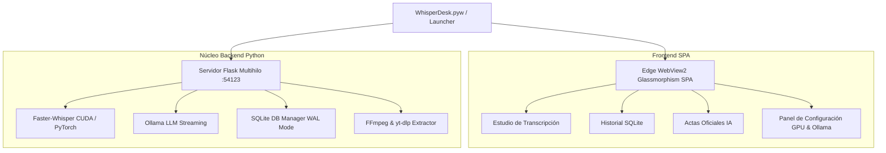

# 🎙️ WhisperDesk Studio Pro v2.0

<div align="center">

[](https://www.python.org/downloads/)
[](https://pytorch.org/)
[](https://github.com/SYSTRAN/faster-whisper)
[](https://ollama.ai/)
[]()
[]()

**Estudio Profesional de Transcripción por Voz Acelerada en GPU (NVIDIA CUDA) y Redacción de Actas Oficiales con IA Local (Ollama).**

</div>

---

## 🌟 Descripción General

**WhisperDesk Studio Pro** es una plataforma de escritorio de alto rendimiento diseñada para profesionales, empresas, abogados, médicos, periodistas y creadores de contenido que requieren transcribir audios y videos de cualquier duración con máxima precisión, privacidad 100% local (sin enviar datos a la nube) y generar Actas Oficiales de Sesión con Inteligencia Artificial en segundos.

Impulsado por el motor neural **Faster-Whisper (CTranslate2)** con aceleración por Tensor Cores en GPUs NVIDIA (CUDA) y sincronizado con **Ollama** para redacción estructurada en tiempo real.

---

## ⚡ Instalación Rápida en 1 Solo Clic (Para quien clona el repo)

Si acabas de clonar el repositorio, no necesitas configurar entornos ni escribir comandos manuales:

1. **Clona el repositorio:**
```bash
git clone https://github.com/SrDelirios/whisperdesk-studio-pro.git
cd whisperdesk-studio-pro
```

2. **Ejecuta el Autoinstalador:**
> **Haz doble clic en `install.bat`** (o en `WhisperDesk_Studio.bat`).

El script inteligente realizará automáticamente todo lo siguiente:
- ✅ Verifica que Python esté instalado.
- ✅ Crea un entorno virtual aislado (`.venv`).
- ✅ Detecta automáticamente si tienes tarjeta gráfica NVIDIA (`nvidia-smi`) e instala PyTorch con soporte **CUDA 12.1** (o modo CPU optimizado).
- ✅ Instala todas las dependencias de `requirements.txt`.
- ✅ Comprueba **FFmpeg** y lo configura localmente si no está en el sistema.
- ✅ Genera un acceso directo en tu Escritorio e inicia la aplicación.

---

## 🚀 Características Principales

### ⚡ 1. Carga de Archivos Ultrarrápida (0 Segundos)
- **Zero-Latency Ingestion:** Arrastre global y selector nativo de Windows que enlazan archivos directamente desde el disco sin transferencias lentas por red.
- **Soporte de Archivos Gigantes:** Procesa archivos de 15 GB+ al instante.
- **Conversión FFmpeg Invisible:** Extracción automática de audio WAV 16kHz mono ejecutada en segundo plano con banderas `CREATE_NO_WINDOW` de Windows (sin consolas negras molestas).

### 🌐 2. Extractor de YouTube con Evasión Anti-403
- **Descargas Resilientes:** Cliente adaptativo (`android`, `web`, `mweb`) con emulación de cabeceras de navegador real.
- **Bypass 403 Forbidden:** Descarga y normalización de audio a 16kHz en < 15 segundos evadiendo bloqueos de YouTube.

### 🧠 3. Motor de Transcripción Whisper en GPU
- **Modelos Integrados:** `tiny`, `base`, `small`, `medium`, `large-v3`, `large-v3-turbo` (predeterminado).
- **Streaming en Vivo (SSE):** Transmisión token por token y barra de progreso real mediante Server-Sent Events.
- **Diarización Heurística Fluida:** Agrupación inteligente de turnos de diálogo por pausas naturales y detección tentativa de nombres de interlocutores.

### 📜 4. Actas Oficiales con IA Local (Ollama Streaming)
- **Optimizador Semántico de Contexto:** Extrae un extracto de alta densidad (apertura, compromisos, conclusiones) procesando reuniones de +1h 30m en < 2 segundos en la GPU.
- **Estructura Corporativa Completa:**
  - 📌 Síntesis Ejecutiva
  - 🎯 Acuerdos y Decisiones Clave
  - ✅ Compromisos y Tareas Asignadas (Action Items con checkboxes)
  - 💡 Puntos de Debate y Temas Pendientes
- **Fallback Offline Heurístico:** Si Ollama está apagado, conmuta automáticamente a un generador offline estructurado sin arrojar errores.

### 💾 5. Base de Datos Estructurada SQLite (whisper_sessions.db)
- **Modo WAL (Write-Ahead Logging):** Concurrencia ultra-rápida y lecturas/escrituras no bloqueantes.
- **Almacenamiento Separado:** Diálogos con hablantes (`speaker_text`), texto limpio para lectura (`plain_text`), objetos JSON de turnos (`segments_json`) y vinculación persistente con el audio.

### 🎵 6. Reproductor de Audio Sincronizado
- **Scrubber Interactivo:** Salto a cualquier punto del audio con un clic en la marca de tiempo de cada intervención.
- **Controles Avanzados:** Velocidades 1.0x, 1.25x, 1.5x, 2.0x, silenciador y barra de progreso fluida.

---

## 🏗️ Arquitectura del Sistema



---

## 💻 Requisitos del Sistema

- **Sistema Operativo:** Windows 10 / Windows 11 (64-bit)
- **GPU (Recomendada):** NVIDIA RTX con soporte CUDA 12.x (Compatible también con CPU)
- **Software Requerido:**
  - Python 3.10 o superior
  - [Ollama](https://ollama.ai/) (Opcional, para resúmenes con IA Local como `qwen2.5:latest` o `llama3.2:latest`)

---

## 📂 Estructura de Archivos

```
whisperdesk-studio-pro/
├── install.bat              # Autoinstalador 1-clic (detecta GPU/CPU y configura .venv)
├── WhisperDesk_Studio.bat   # Lanzador inteligente de la aplicación
├── WhisperDesk.bat          # Lanzador modo navegador clásico
├── app.py                   # Servidor API Flask con Server-Sent Events (SSE)
├── database.py              # Administrador SQLite con WAL mode y migración
├── transcriber.py           # Motor Faster-Whisper GPU con auto-purga de VRAM
├── summarizer.py            # Generador de Actas Ollama + Optimizador Semántico
├── diarizer.py              # Motor de diarización heurística y turnos de diálogo
├── youtube.py               # Extractor de audio YouTube anti HTTP 403
├── WhisperDesk.pyw          # Lanzador nativo Edge WebView2 con HWND Icon
├── requirements.txt         # Dependencias del proyecto
├── MAPA_DEL_SISTEMA.md      # Mapa exhaustivo de arquitectura y especificaciones
├── templates/
│   └── index.html           # SPA Studio Pro Glassmorphism
└── static/
    ├── css/style.css        # Estilos Dark Studio Glass y tokens de diseño
    └── js/app.js            # Lógica cliente, SSE Stream Reader y Audio Player
```

---

## 📜 Formatos de Exportación

- **Texto Plano (`.txt`):** Texto continuo limpio o diálogo con etiquetas de hablantes.
- **Subtítulos (`.srt`):** Subtítulos temporizados estándar para editores de video (Premiere, DaVinci, CapCut).
- **Subtítulos Web (`.vtt`):** Subtítulos WebVTT para reproductores web y HTML5.
- **Acta Oficial (`.md`):** Documento Markdown listo para compartir o exportar a Notion/PDF.

---

## 📄 Licencia

Este proyecto está bajo la Licencia MIT. Consulta el archivo `LICENSE` para más detalles.

---

**Desarrollado con ❤️ por Tavo Mejía (@SrDelirios)**
